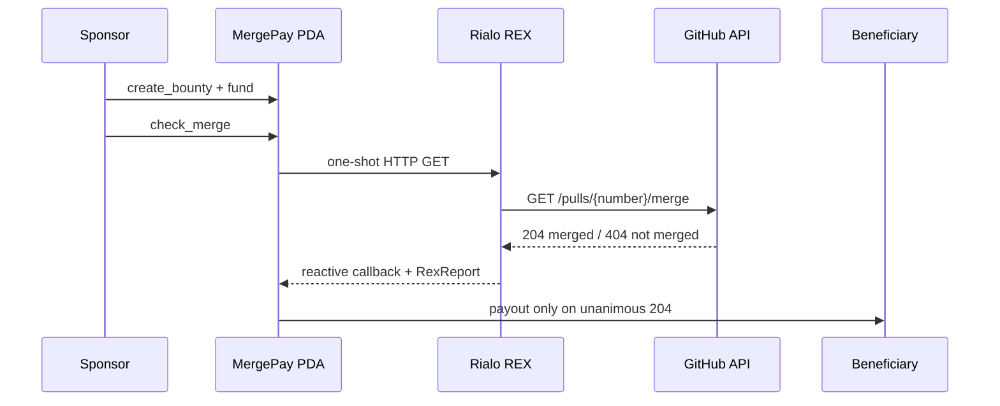

# MergePay

Reactive GitHub pull-request bounties on Rialo.

MergePay lets a sponsor lock native RLO for one GitHub pull request. Rialo REX checks
GitHub's compact merge-status endpoint and a reactive callback releases the escrow to
the committed beneficiary only when every validator result agrees that the PR merged.
If the deadline expires first, the sponsor can recover the escrow.

No keeper, webhook server, cron job, or trusted payout backend is required.

The reviewer-facing web app can use either a future Wallet Standard extension through
Frost or a DevNet-only embedded Rialo signer. The embedded key is generated locally,
stored only as password-encrypted ciphertext, and signs real transactions after an
explicit review screen; it is not a production wallet and must not hold real funds.

The dApp now reads each sponsor-derived workflow PDA directly from DevNet. A confirmed
create opens the decoded record, and an unfunded record exposes a sponsor-only funding
action that re-reads on-chain state and balance before signing the exact escrow amount.
Funded records expose a real REX merge check, track the asynchronous callback through
Rialo workflow lineage, and show payout only after the decoded account confirms it.
Once an unpaid workflow expires, the merge action is replaced by a sponsor-only refund
that re-verifies eligibility before returning the exact escrow amount.

## DevNet status

| Item | Value |
| --- | --- |
| Active runtime-proven program | `6QHxmfBi9DEhrcdg65c87Hp9H5Ny3xSTCT4b9vaDTsFB` |
| Previous reset deployment | `4VWR2cKxy5gGjcm74i36T2DKH9xPzHqKoydgaL9Q4Z6F` |
| Rialo release | `stable@0.18.1` |
| Program format | RISC-V / PolkaVM |
| Hardened artifact | `196167` bytes; deployed and runtime-proven |
| Merged-PR payout | Proven on DevNet |
| Open-PR no-payout | Proven on DevNet |
| Early refund rejection | Proven on DevNet |
| Post-deadline refund | Proven on DevNet |

DevNet may be reset. The active deployment and current signatures are recorded in
[docs/EVIDENCE.md](docs/EVIDENCE.md); the previous deployment is retained there as
historical evidence only.

## Repository layout

```text
apps/web/                    Reviewer-facing dApp
programs/mergepay-rialo/     Rialo Venus program, WIT, and artifact builder
packages/rialo-client/       Typed boundary between the dApp and program
deployments/                 Versioned network records and artifact fingerprints
docs/                        Architecture, security, evidence, and submission notes
scripts/                     Repeatable repository automation
```

The root `Cargo.toml` owns the Rust workspace. Web packages are managed from the root
`package.json`. Build caches, local artifacts, environment files, and key material are
excluded from version control.

## Why this belongs on Rialo

MergePay is a small but complete example of Rialo's native reactive model:

1. A sponsor creates and funds an onchain workflow PDA.
2. The sponsor schedules a one-shot HTTP REX request.
3. Validators query GitHub's merge-status endpoint.
4. Rialo triggers the subscribed callback with a `RexReport`.
5. A unanimous `204` result releases escrow; unanimous `404` keeps it locked.

The external fact and the financial settlement stay inside one auditable workflow.
This follows Rialo's model of validator-driven reactive execution and hybrid onchain /
external-data workflows described in the
[Rialo reactive transactions article](https://rialo.io/posts/reactive-transactions-a-model-for-native-automation-on-rialo/).



## Contract behavior

The workflow stores the sponsor, beneficiary, repository coordinates, PR number,
escrow amount, millisecond deadline, and terminal flags.

- `create_bounty` initializes one sponsor-derived workflow PDA.
- `fund` transfers the exact bounty amount into that PDA.
- `check_merge` is sponsor-only and schedules the REX request.
- `handle_merge_response` is callback-only and receives the beneficiary as a writable
  account plus the `RexReport` as its final parameter.
- `refund` is sponsor-only and succeeds only after the deadline.
- `status` logs the persisted state for review.

Payout and refund retain `Rent::minimum_balance(...)` in the workflow account. Paid or
refunded workflows cannot release the escrow again.

See [docs/ARCHITECTURE.md](docs/ARCHITECTURE.md) for the generated callback ABI and
state transitions, and [docs/SECURITY.md](docs/SECURITY.md) for trust assumptions and
known limits.

## Build

The following versions produced the deployed artifact:

- Ubuntu 24.04 under WSL2
- `rialoman 0.3.0`
- Rialo CLI `0.18.1-2e1fdefe31cc`
- Rialo Rust toolchain `0.0.3`
- target `riscv64emac-solana-solana`

From the repository root in WSL:

```bash
CARGO_TARGET_DIR=/tmp/mergepay-rialo-target cargo check -p mergepay-rialo
cargo build --manifest-path programs/mergepay-rialo/artifact/Cargo.toml
```

The deployable binary is generated under
`programs/mergepay-rialo/target/rialo-build/`. Deploy the whole Venus project after
building:

```bash
rialo -n devnet -a default client program deploy-venus programs/mergepay-rialo
```

## Reproduce a workflow

Use a fresh 64-character hex slug. All CLI aliases below refer to local keypairs;
never commit those keypair files.

```bash
MERGEPAY_PROGRAM_ID=6QHxmfBi9DEhrcdg65c87Hp9H5Ny3xSTCT4b9vaDTsFB
MERGEPAY_SLUG=0000000000000000000000000000000000000000000000000000000000000008
MERGEPAY_BENEFICIARY=REPLACE_WITH_PUBLIC_BENEFICIARY_ADDRESS
MERGEPAY_DEADLINE_MS=REPLACE_WITH_FUTURE_UNIX_MILLISECONDS

rialo -n devnet -a default client program invoke "$MERGEPAY_PROGRAM_ID" \
  --program-dir programs/mergepay-rialo --function create_bounty \
  --arg workflow_pda_slug="$MERGEPAY_SLUG" \
  --arg beneficiary="$MERGEPAY_BENEFICIARY" \
  --arg github_owner=microsoft \
  --arg github_repo=vscode \
  --arg pull_number=332677 \
  --arg amount_kelvin=1000000 \
  --arg deadline_unix_ms="$MERGEPAY_DEADLINE_MS"

rialo -n devnet -a default client program invoke "$MERGEPAY_PROGRAM_ID" \
  --program-dir programs/mergepay-rialo --function fund \
  --arg workflow_pda_slug="$MERGEPAY_SLUG"

rialo -n devnet -a default client program invoke "$MERGEPAY_PROGRAM_ID" \
  --program-dir programs/mergepay-rialo --function check_merge \
  --arg workflow_pda_slug="$MERGEPAY_SLUG"
```

Inspect the initiating transaction, then follow its reactive child:

```bash
rialo -n devnet client transaction REPLACE_WITH_SIGNATURE
rialo -n devnet client get-workflow-lineage REPLACE_WITH_SIGNATURE
```

Important: `deadline_unix_ms` is intentionally named with its unit. Rialo DevNet
`0.18.1` was observed onchain returning millisecond clock values.

## GitHub signal

MergePay calls:

```text
GET https://api.github.com/repos/{owner}/{repo}/pulls/{number}/merge
```

GitHub documents `204` as merged and `404` as not merged for this endpoint. The compact
endpoint also avoids the REX response-size failure observed with the full PR JSON.
See GitHub's [pull-request REST documentation](https://docs.github.com/en/rest/pulls/pulls#check-if-a-pull-request-has-been-merged).

## Review package

- [Architecture](docs/ARCHITECTURE.md)
- [Security and limitations](docs/SECURITY.md)
- [DevNet evidence](docs/EVIDENCE.md)
- [Builder submission draft](docs/BUILDER_SUBMISSION.md)

License: Apache-2.0.

## DevNet review

MergePay can be reviewed with a public GitHub pull request and the Rialo DevNet wallet.
