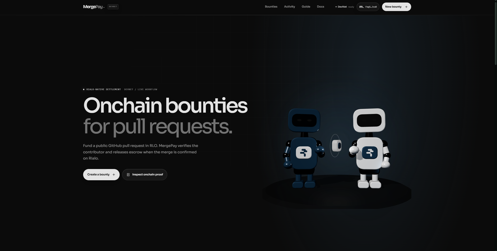
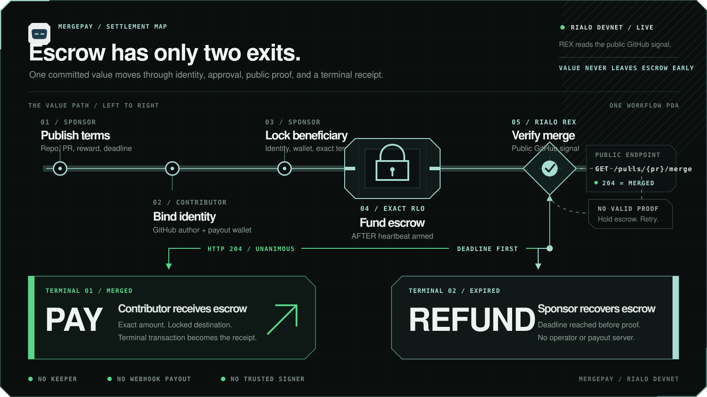

<div align="center">
  
  <h1>MergePay</h1>
  <p><strong>Onchain bounties for pull requests.</strong></p>
  <p>
    Fund public GitHub work in native RLO. MergePay verifies the contributor,
    watches the pull request through Rialo REX, and settles escrow automatically.
  </p>

  <p>
    <a href="https://github.com/Alice699/mergepay/actions/workflows/ci.yml"></a>
    
    
    <a href="LICENSE"></a>
  </p>

  <p>
    <a href="#overview">Overview</a> ·
    <a href="#how-it-works">How it works</a> ·
    <a href="#devnet-proof">DevNet proof</a> ·
    <a href="#run-locally">Run locally</a> ·
    <a href="#security">Security</a>
  </p>
</div>

<p align="center">
  
</p>

> [!IMPORTANT]
> MergePay is an unaudited DevNet MVP. It uses test RLO and must not be used with production funds.

## Overview

MergePay turns a public GitHub pull request into an auditable Rialo workflow. A sponsor
publishes a bounty, a contributor proves that they authored the target pull request,
and the sponsor locks the exact reward in escrow. After funding, a native Rialo timer
checks GitHub through REX until one of two terminal outcomes is reached:

- a unanimous merged result releases the bounty to the approved contributor; or
- the immutable deadline returns the escrow to the sponsor.

The settlement path does not rely on a keeper, webhook server, cron job, trusted payout
backend, or expiring GitHub App installation token. Sponsor-triggered check and refund
actions remain available as idempotent fallbacks.

### Product highlights

| Capability | What MergePay provides |
| --- | --- |
| Verified contributor | GitHub OAuth binds the public PR author to a specific Rialo receiving wallet. |
| Exact escrow | The sponsor reviews the claim and funds the committed RLO amount onchain. |
| Native automation | Rialo `AFTER` timers keep merge polling and deadline settlement alive after funding. |
| Fail-closed proof | Empty, mixed, malformed, or failed REX reports cannot release escrow. |
| Live interface | Workflow state refreshes in place, transactions surface through notifications, and wallet history uses cursor-based DevNet pagination. |
| Reviewer-friendly wallet | A password-encrypted embedded signer provides DevNet onboarding without simulating funds or success states. |

## How it works

<p align="center">
  
</p>

1. **Publish** — the sponsor commits a public repository, pull request, reward, and deadline.
2. **Claim** — the contributor signs in with GitHub and links the verified PR identity to a Rialo wallet.
3. **Approve** — the sponsor checks the exact identity, wallet, and bounty terms before accepting the claim.
4. **Fund** — MergePay prepares the workflow account, transfers the exact RLO escrow, and arms native settlement.
5. **Verify** — Rialo REX validators query GitHub's compact merged-status endpoint.
6. **Settle** — unanimous HTTP `204` pays the contributor; reaching the deadline first refunds the sponsor.

### Why Rialo

On a conventional chain, this flow usually needs a GitHub listener, oracle adapter,
keeper, payout signer, and refund scheduler. MergePay keeps the external signal,
workflow state, timers, callback, and value transfer inside one reactive protocol flow:

```text
GitHub merge status → Rialo REX report → reactive callback → onchain settlement
```

Learn more about the model in Rialo's
[reactive transactions overview](https://rialo.io/posts/reactive-transactions-a-model-for-native-automation-on-rialo/).

## DevNet proof

The active deployment has been exercised end to end for automatic payout, automatic
refund, and the manual-refund race guard.

| Item | Current value |
| --- | --- |
| Network | Rialo DevNet |
| Active program | `6LwYmJtjnrJqSRy6fgWHY7pUZcYtrQ6FD8qwyCeKWe5` |
| Program format | RISC-V / PolkaVM |
| Rialo release | `stable@0.18.1` |
| Deployed artifact | `231,269` bytes at slot `11,428,520` |
| Automatic merged-PR payout | Proven on DevNet |
| Automatic deadline refund | Proven on DevNet |
| Manual fallback after automatic refund | Idempotent; no double release |

Full transaction signatures, workflow PDAs, callback logs, balances, artifact hash,
and historical deployments are recorded in [DevNet evidence](docs/EVIDENCE.md) and
[deployment metadata](deployments/devnet.json).

## Architecture

MergePay is a small monorepo with explicit boundaries between product UI, protocol
integration, and onchain logic.

```text
apps/web/                    Vinext + React reviewer-facing dApp
packages/rialo-client/       Typed ABI, PDA, RPC, and transaction boundary
programs/mergepay-rialo/     Rialo Venus workflow and PolkaVM artifact builder
deployments/                 Versioned DevNet deployment metadata
docs/                        Architecture, security, evidence, and setup guides
scripts/                     Repeatable deployment and verification utilities
```

| Layer | Technology | Responsibility |
| --- | --- | --- |
| Web | React 19, Vinext, TypeScript | Marketplace, wallet UX, live workflow state, and transaction feedback. |
| Client | `@rialo/ts-cdk`, typed MergePay package | Instruction encoding, PDA derivation, RPC reads, signing boundary, and confirmation. |
| Program | Rust, Rialo Venus `0.18.1` | Escrow invariants, claims, native timers, REX callbacks, payout, and refund. |
| External proof | Rialo REX + GitHub REST API | Validator-attested public pull-request merge signal. |

The workflow PDA stores the immutable bounty terms and terminal state. Contributor
claims use separate contributor-derived PDAs; the sponsor must approve a matching claim
before funding. See [Architecture](docs/ARCHITECTURE.md) for account layouts, state
transitions, callback ABI details, and retry behavior.

## Run locally

### Prerequisites

- Node.js `22.13` or newer
- npm
- GitHub OAuth credentials when testing contributor identity verification
- Rust and the Rialo toolchain only when building the onchain program

### Start the dApp

```bash
git clone https://github.com/Alice699/mergepay.git
cd mergepay
npm ci
cp apps/web/.env.example apps/web/.env.local
npm run dev
```

On PowerShell, copy the environment template with:

```powershell
Copy-Item apps/web/.env.example apps/web/.env.local
```

Then open `http://localhost:3000`. The root development command builds the typed client
before starting the web app.

### Environment

The checked-in template targets the active DevNet deployment:

```dotenv
NEXT_PUBLIC_RIALO_NETWORK=devnet
NEXT_PUBLIC_RIALO_RPC_URL=/api/rialo
RIALO_RPC_UPSTREAM_URL=https://devnet.rialo.io
NEXT_PUBLIC_MERGEPAY_PROGRAM_ID=6LwYmJtjnrJqSRy6fgWHY7pUZcYtrQ6FD8qwyCeKWe5
```

Contributor verification additionally uses `GITHUB_OAUTH_CLIENT_ID`,
`GITHUB_OAUTH_CLIENT_SECRET`, `GITHUB_OAUTH_REDIRECT_URI`, and a strong
`GITHUB_SESSION_SECRET`. Follow [GitHub OAuth setup](docs/GITHUB_OAUTH_SETUP.md) for the
exact callback configuration.

> [!NOTE]
> GitHub OAuth is used for contributor identity binding. The active public-repository
> settlement flow does **not** require `GITHUB_APP_ID`, an installation token, or a
> GitHub App private key.

Never commit `.env` files, OAuth secrets, private keys, or wallet exports.

## Verification

Run the same primary checks used by CI:

```bash
npm run typecheck
npm run lint
npm run test
npm run build
npm run check:program
```

The GitHub Actions workflow verifies the web app, typed client, production build, and
Rialo program on pushes to `main` and on pull requests.

### Build and deploy the program

The deployed artifact was produced on Ubuntu 24.04 under WSL2 with Rialo CLI `0.18.1`
and the Rialo Rust toolchain:

```bash
npm run build:program
rialo -n devnet -a default client program deploy-venus programs/mergepay-rialo
```

Deployment changes must also update `deployments/devnet.json` and include inspectable
runtime evidence in `docs/EVIDENCE.md`.

## Security

MergePay is designed to fail closed:

- payout requires a non-empty, unanimous successful REX report;
- the callback account must match the committed beneficiary;
- sponsor-only actions recheck the committed sponsor and workflow state;
- `paid` and `refunded` flags prevent replayed settlement;
- checked arithmetic and ownership checks protect escrow accounting;
- only the committed escrow amount moves, preserving the workflow's state/rent balance;
- OAuth tokens remain server-side, while embedded wallet keys remain encrypted in the browser.

Current scope is intentionally narrow: DevNet, native RLO, public GitHub repositories,
one sponsor, one approved beneficiary, and one pull request per workflow. The program has
not been audited. Read [Security and limitations](docs/SECURITY.md) before extending or
deploying it beyond its current review environment.

## Documentation

| Document | Purpose |
| --- | --- |
| [Architecture](docs/ARCHITECTURE.md) | State machine, account model, timers, REX flow, and callback ABI. |
| [Security](docs/SECURITY.md) | Invariants, trust assumptions, fail-closed behavior, and known limitations. |
| [DevNet evidence](docs/EVIDENCE.md) | Transaction signatures, callback lineage, balances, and deployment proof. |
| [GitHub OAuth setup](docs/GITHUB_OAUTH_SETUP.md) | Identity-verification app configuration and environment variables. |
| [Builder submission](docs/BUILDER_SUBMISSION.md) | Concise reviewer narrative and demo checklist. |
| [Contributing](CONTRIBUTING.md) | Repository boundaries and review expectations. |

## Contributing

Issues and pull requests are welcome. Keep changes within the owning package, add tests
for behavioral changes, and run the verification commands before requesting review.
Every new DevNet claim should include an inspectable transaction or callback in
`docs/EVIDENCE.md`.

## License

Licensed under the [Apache License 2.0](LICENSE).
