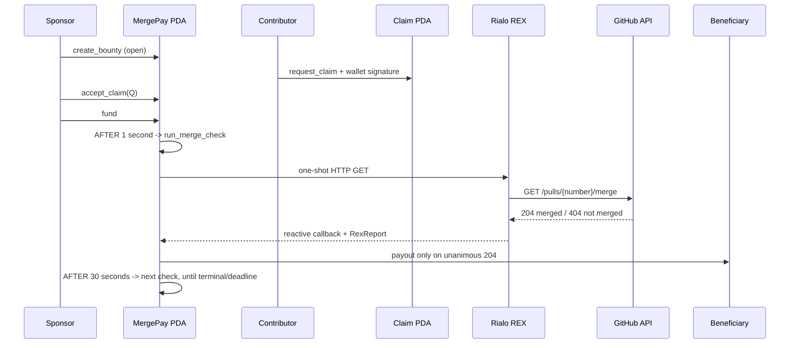

# MergePay

An onchain GitHub bounty marketplace on Rialo.

MergePay lets a sponsor publish a native RLO bounty for one GitHub pull request. A
contributor proves the public PR author, signs a claim with the wallet that should be
paid, and shares that claim with the sponsor. The sponsor approves the matching claim
before funding. After funding, native Rialo timers poll GitHub through REX until a
unanimous merged result pays the contributor or the deadline refund path settles the
escrow back to the sponsor. If needed, the sponsor can still request an immediate
manual check or refund fallback. Funding also attaches a sponsor-bound, DKG-encrypted
GitHub App authorization envelope so REX does not depend on GitHub's shared anonymous
API quota.

Verified payout does not depend on a keeper, webhook server, cron job, or trusted payout
backend. The current source candidate uses native `AFTER` timers for both merge polling
and deadline refund. It still needs a fresh deployment and DevNet lineage proving the
timer callbacks end to end before the autonomous path can be called runtime-proven.

The reviewer-facing web app can use either a future Wallet Standard extension through
Frost or a DevNet-only embedded Rialo signer. The embedded key is generated locally,
stored only as password-encrypted ciphertext, and signs real transactions after an
explicit review screen; it is not a production wallet and must not hold real funds.

The dApp now reads each sponsor-derived workflow PDA directly from DevNet. A confirmed
create opens the decoded record as an open marketplace bounty. The contributor claim
flow verifies the public GitHub author through a same-origin API route, creates a
contributor-owned claim record, and gives the sponsor an approval action that rechecks
every immutable term before locking the beneficiary. Only then does the unfunded record
expose a sponsor-only funding action that re-reads on-chain state and balance before
signing the exact escrow amount.
Funded records expose the native settlement watch plus a sponsor fallback REX action,
track asynchronous callbacks through Rialo workflow lineage, and show payout only
after the decoded account confirms it.
Once an unpaid workflow expires, the merge action is replaced by a sponsor-only refund
that re-verifies eligibility before returning the exact escrow amount.

The `/bounties` page also performs live discovery: it reads the MergePay program history
in 25-signature pages, follows a Rialo `before` cursor when the contributor loads older
listings, decodes the related workflow accounts, and shows only valid, future, non-terminal
records. Legacy ABI create instructions, invalid workflow PDAs, and malformed account
fields are excluded. The marketplace provides scope, status, repository, deadline, and
text filters, while clearly labeling the shared DevNet data. A persistent server-side
historical indexer remains a separate release task.

## DevNet status

| Item | Value |
| --- | --- |
| Active runtime-proven program | `6QHxmfBi9DEhrcdg65c87Hp9H5Ny3xSTCT4b9vaDTsFB` |
| Autonomous settlement ABI | `Gdbcab4Wn5zyUYAP8C7MZzWtfbsVpYX3k6FuhnY5Dbe3` — deployed, E2E pending |
| Superseded marketplace ABI | `5uaASo6AePkzUTFf7vBqRpU8XwxRZK5QzcLQ96CyAj3S` — historical |
| Previous reset deployment | `4VWR2cKxy5gGjcm74i36T2DKH9xPzHqKoydgaL9Q4Z6F` |
| Rialo release | `stable@0.18.1` |
| Program format | RISC-V / PolkaVM |
| Hardened artifact | `196167` bytes; deployed and runtime-proven |
| Merged-PR payout | Proven on DevNet |
| Open-PR no-payout | Proven on DevNet |
| Early refund rejection | Proven on DevNet |
| Post-deadline refund | Proven on DevNet |

DevNet may be reset. The active deployment and current signatures are recorded in
[docs/EVIDENCE.md](docs/EVIDENCE.md); the previous deployment is retained there as
historical evidence only.

The latest autonomous-settlement ABI is deployed at
`Gdbcab4Wn5zyUYAP8C7MZzWtfbsVpYX3k6FuhnY5Dbe3`, with the artifact fingerprint and
loader metadata recorded in [deployments/devnet.json](deployments/devnet.json). The
claim, autonomous payout, and autonomous refund E2E flow still needs to be run before
this ABI is called runtime-proven. The previous marketplace deployment is retained
as superseded deployment history.
The earlier `6QHx…` deployment remains the legacy runtime evidence.

## Repository layout

```text
apps/web/                    Reviewer-facing dApp
programs/mergepay-rialo/     Rialo Venus program, WIT, and artifact builder
packages/rialo-client/       Typed boundary between the dApp and program
deployments/                 Versioned network records and artifact fingerprints
docs/                        Architecture, security, evidence, and submission notes
scripts/                     Repeatable repository automation
```

The root `Cargo.toml` owns the Rust workspace. Web packages are managed from the root
`package.json`. Build caches, local artifacts, environment files, and key material are
excluded from version control.

## Why this belongs on Rialo

MergePay is a small but complete example of Rialo's native reactive model:

1. A sponsor creates an open bounty workflow PDA.
2. A contributor verifies the PR author and creates a separate claim PDA.
3. The sponsor approves the claim and funds the exact escrow amount.
4. Funding arms one native settlement heartbeat for merge polling and deadline refund.
5. Validators query GitHub's merge-status endpoint and Rialo triggers the callback.
6. A unanimous `204` result releases escrow; unanimous `404` keeps it locked until the
   next native retry or deadline refund.

The external fact and the financial settlement stay inside one auditable workflow.
This follows Rialo's model of validator-driven reactive execution and hybrid onchain /
external-data workflows described in the
[Rialo reactive transactions article](https://rialo.io/posts/reactive-transactions-a-model-for-native-automation-on-rialo/).



## Contract behavior

The main workflow stores the sponsor, approved beneficiary (or an unassigned sentinel),
repository coordinates, PR number, escrow amount, millisecond deadline, claim metadata,
and terminal flags. A contributor claim is another workflow account owned by the
contributor wallet and points back to the sponsor's bounty.

- `create_bounty` initializes one sponsor-derived workflow PDA.
- `request_claim` creates a contributor-derived claim record after checking the target
  bounty is open and the contributor is not the sponsor.
- `request_claim` requires the contributor's GitHub OAuth identity to match the exact
  public PR author; the claim PDA stores the canonical login and numeric GitHub user ID.
- `accept_claim` is sponsor-only and copies a matching contributor wallet and GitHub
  identity into the main bounty before funding.
- `fund` obtains a short-lived read-only GitHub App installation token server-side,
  encrypts the `Authorization` header for REX, transfers the exact bounty amount into
  that PDA, and registers the native settlement heartbeat.
- `run_merge_check` re-arms a short native timer, checks the deadline on every pass,
  and starts a GitHub REX request at most every 30 seconds, so merge polling and
  deadline refund do not depend on a sponsor click.
- `check_merge` remains sponsor-only as an immediate fallback. The web client submits
  the generated handler with the workflow's next Venus branch so every fallback gets
  fresh one-shot REX/subscription accounts.
- `handle_merge_response` is callback-only and receives the beneficiary as a writable
  account plus the `RexReport` as its final parameter.
- `refund` is sponsor-only and succeeds only after the deadline.
- `status` logs the persisted state for review.

The source candidate registers `AFTER 1 second CALL [run_merge_check]` during `fund`.
That native heartbeat re-arms itself inside Rialo, uses the normalized Unix-millisecond
deadline to choose payout versus refund, and reuses the sponsor, terminal-state, rent,
and balance checks from the manual paths. The source and artifact build are validated
locally; deployment and DevNet lineage for autonomous merged payout and expired refund
remain the next proof step.

Payout and refund retain `Rent::minimum_balance(...)` in the workflow account. Paid or
refunded workflows cannot release the escrow again.

See [docs/ARCHITECTURE.md](docs/ARCHITECTURE.md) for the generated callback ABI and
state transitions, and [docs/SECURITY.md](docs/SECURITY.md) for trust assumptions and
known limits.

## Build

The following versions produced the deployed artifact:

- Ubuntu 24.04 under WSL2
- `rialoman 0.3.0`
- Rialo CLI `0.18.1-2e1fdefe31cc`
- Rialo Rust toolchain `0.0.3`
- target `riscv64emac-solana-solana`

From the repository root in WSL:

```bash
CARGO_TARGET_DIR=/tmp/mergepay-rialo-target cargo check -p mergepay-rialo
cargo build --manifest-path programs/mergepay-rialo/artifact/Cargo.toml
```

The deployable binary is generated under
`programs/mergepay-rialo/target/rialo-build/`. Deploy the whole Venus project after
building:

```bash
rialo -n devnet -a default client program deploy-venus programs/mergepay-rialo
```

GitHub OAuth setup and the exact callback configuration are documented in
[docs/GITHUB_OAUTH_SETUP.md](docs/GITHUB_OAUTH_SETUP.md). Never commit OAuth or
wallet secrets.

## Reproduce a workflow

Use a fresh 64-character hex slug. All CLI aliases below refer to local keypairs;
never commit those keypair files.

```bash
MERGEPAY_PROGRAM_ID=Gdbcab4Wn5zyUYAP8C7MZzWtfbsVpYX3k6FuhnY5Dbe3
MERGEPAY_SLUG=0000000000000000000000000000000000000000000000000000000000000008
# Use the zero pubkey to publish an open bounty. The sponsor approves the real
# contributor wallet later with accept_claim.
MERGEPAY_BENEFICIARY=11111111111111111111111111111111
MERGEPAY_DEADLINE_MS=REPLACE_WITH_FUTURE_UNIX_MILLISECONDS

rialo -n devnet -a default client program invoke "$MERGEPAY_PROGRAM_ID" \
  --program-dir programs/mergepay-rialo --function create_bounty \
  --arg workflow_pda_slug="$MERGEPAY_SLUG" \
  --arg beneficiary="$MERGEPAY_BENEFICIARY" \
  --arg github_owner=microsoft \
  --arg github_repo=vscode \
  --arg pull_number=332677 \
  --arg amount_kelvin=1000000 \
  --arg deadline_unix_ms="$MERGEPAY_DEADLINE_MS"

# The current fund ABI also requires github_auth_ciphertext. Use the web sponsor
# flow to obtain the packed DKG URL + Authorization envelope; never pass a plaintext
# GitHub token to the CLI.

rialo -n devnet -a default client program invoke "$MERGEPAY_PROGRAM_ID" \
  --program-dir programs/mergepay-rialo --function check_merge \
  --arg workflow_pda_slug="$MERGEPAY_SLUG"
```

Inspect the initiating transaction, then follow its reactive child:

```bash
rialo -n devnet client transaction REPLACE_WITH_SIGNATURE
rialo -n devnet client get-workflow-lineage REPLACE_WITH_SIGNATURE
```

Important: `deadline_unix_ms` is intentionally named with its unit. Rialo DevNet
`0.18.1` was observed onchain returning millisecond clock values.

## GitHub signal

MergePay calls:

```text
GET https://api.github.com/repos/{owner}/{repo}/pulls/{number}/merge
```

GitHub documents `204` as merged and `404` as not merged for this endpoint. The compact
endpoint also avoids the REX response-size failure observed with the full PR JSON.
See GitHub's [pull-request REST documentation](https://docs.github.com/en/rest/pulls/pulls#check-if-a-pull-request-has-been-merged).

## Review package

- [Architecture](docs/ARCHITECTURE.md)
- [Security and limitations](docs/SECURITY.md)
- [DevNet evidence](docs/EVIDENCE.md)
- [Builder submission draft](docs/BUILDER_SUBMISSION.md)

License: Apache-2.0.

## DevNet review

MergePay can be reviewed with a public GitHub pull request and the Rialo DevNet wallet.
