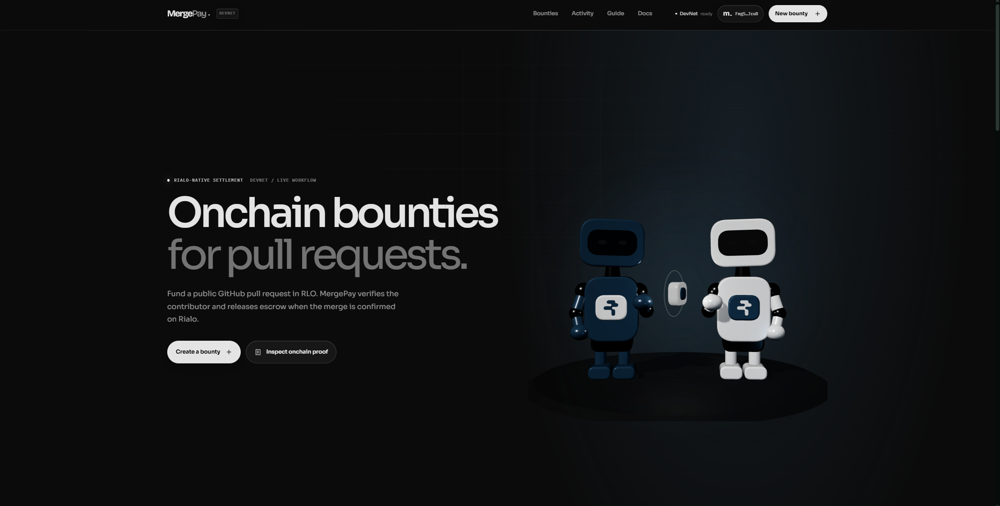
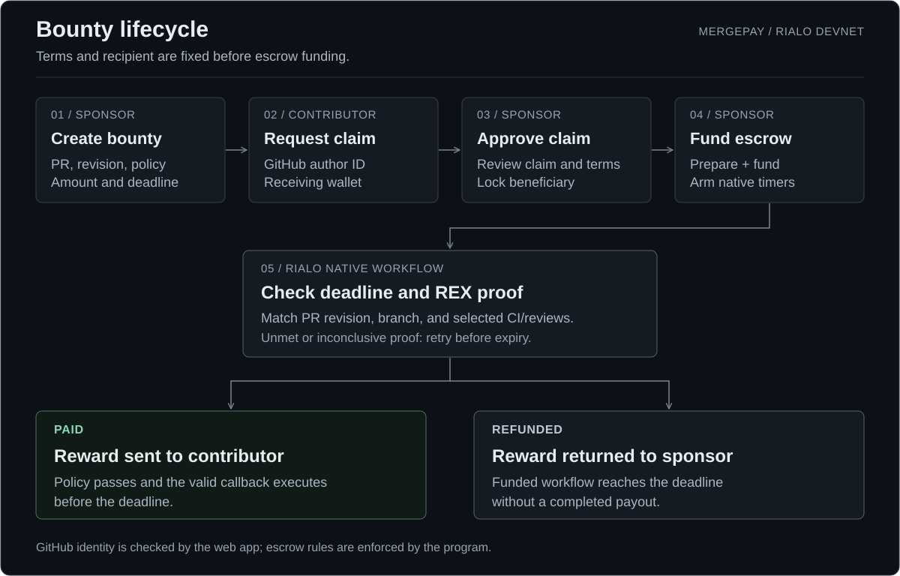

# MergePay

GitHub pull-request bounties with native RLO escrow on Rialo.

[Live app](https://mergepay-mu.vercel.app) ·
[User guide](https://mergepay-mu.vercel.app/guide) ·
[Protocol reference](https://mergepay-mu.vercel.app/docs) ·
[Recorded DevNet evidence](docs/EVIDENCE.md)

[](https://github.com/Alice699/mergepay/actions/workflows/ci.yml)
[](LICENSE)

> [!IMPORTANT]
> MergePay is an unaudited DevNet application. Use test RLO only, not production funds.

## Overview

A sponsor creates a bounty for an existing public pull request, approves the
contributor's receiving wallet, and funds escrow. The bounty commits an exact PR
revision, target branch, reward, deadline, and optional CI or review requirements.

After funding, a native Rialo workflow checks GitHub through REX. A valid proof
that satisfies the locked policy and is processed before the deadline pays the
contributor. If a funded workflow reaches its deadline without payout, escrow
returns to the sponsor.

Users can inspect the workflow account, transaction history, and shareable
settlement receipt. Native automation does not depend on keeping the browser open.

<details>
  <summary>Application preview</summary>
  <p>
    
  </p>
</details>

## How it works

<p>
  
</p>

1. **Create the bounty.** Select **Verify target** to lock the public PR's head
   SHA and target branch. Set the reward, deadline, and optional CI/review policy.
2. **Request a claim.** The PR author connects GitHub and a receiving wallet,
   verifies the author ID, and signs a separate onchain claim record.
3. **Approve the contributor.** The sponsor reviews the identity, wallet, terms,
   claim account, and source transaction. The app rechecks the public PR author
   before approval. Multiple matching claims require an explicit selection.
4. **Fund escrow.** Approval locks the beneficiary. A separate funding transaction
   runs `prepare_funding` and `fund` atomically, then arms the native workflow.
5. **Settle.** Rialo checks the deadline and requests GitHub proof through REX.
   The program validates the received report, locked policy, and accounts before
   paying. Expiry without payout takes the sponsor refund path.

### Settlement rules

- The PR head SHA and target branch must match the committed revision. Selected
  CI and approval requirements must also pass; merge alone is not sufficient.
- All outputs in the received REX report must be usable and identical. Unmet or
  inconclusive proof cannot authorize payout.
- The deadline is an absolute time set when creating the bounty. Funding does
  not restart it. Claim, approval, funding, and a valid payout callback must
  complete before expiry; an earlier GitHub merge does not override a late callback.
- `paid` and `refunded` are mutually exclusive. Only the bounty principal moves;
  settlement does not close the workflow or return its remaining storage balance.

**Run check now** requests a proof check only while a funded workflow is active
and before expiry. Sponsor refund is available after the deadline. Neither
fallback bypasses the policy; repeating an already-completed refund does not
release escrow again.

## Why Rialo

The payment condition lives on GitHub, while the reward and settlement rules
live onchain. Rialo provides both parts needed to connect them: REX for external
evidence and native `AFTER` execution for a workflow that waits, checks, and resumes.

The web app handles identity verification, wallet interactions, and account
reads. The program handles escrow and settlement. The funded workflow does not
need a separate application keeper, cron job, or privileged payout server.
GitHub and Rialo remain dependencies; settlement is asynchronous, not a guaranteed
instant response to merge.

See Rialo's [reactive transactions overview](https://rialo.io/posts/reactive-transactions-a-model-for-native-automation-on-rialo/)
for the underlying execution model.

## Architecture

| Component | Location | Responsibility |
| --- | --- | --- |
| Web application | [`apps/web`](apps/web) | React 19, Vinext, and TypeScript. Bounty discovery, GitHub identity, wallet UX, and decoded workflow views. |
| Typed client | [`packages/rialo-client`](packages/rialo-client) | Rialo CDK integration, instruction encoding, PDA derivation, RPC reads, and transaction confirmation. |
| Rialo program | [`programs/mergepay-rialo`](programs/mergepay-rialo) | Rust and Venus `0.18.1`. Claims, escrow accounting, native timers, and REX callbacks. |
| GitHub verifier | [`program source`](programs/mergepay-rialo/src/lib.rs) | Custom REX WASM reads PR details and, when required, commit statuses, check runs, and reviews. |

The bounty and contributor claim use separate PDAs. The sponsor approves one
claim; the program checks the matching terms and locks its beneficiary.
Account layouts, state transitions, and callback details are documented in
[Architecture](docs/ARCHITECTURE.md).

## DevNet deployment and evidence

The repository's default deployment is recorded in
[`deployments/devnet.json`](deployments/devnet.json). This is deployment metadata,
not a live network-health indicator.

| Item | Recorded value |
| --- | --- |
| Network | Rialo DevNet |
| Program | `EJPnYc1o5BPL3A9PLSBNVcNZg6e9qNH1adQBM6ZG3s31` |
| REX bytecode account | `GcTo6NvSBvszmBogd7y4x9NYMG8ACuVrKy6mcYtQSoJK` |
| Executable format | RISC-V / PolkaVM |
| Artifact size | 252,425 bytes |
| Deployment slot | 18,508,684 |

Recorded smoke tests from **21 September 2026** use the program above. Neither
scenario used the sponsor's manual check or refund button.

| Scenario | Workflow account | Recorded outcome |
| --- | --- | --- |
| Merged PR payout, `mergepay-demo#14` | `ExTgFzvmimca9QizRx9KqUGoNwA6tpUvCtvKHD3CU5ri` | `paid=true`, `refunded=false` |
| Unmerged PR refund, `mergepay-demo#27` | `DRPYwPSLbuDjjwtpY9MExJDFs8EsCdGA7X75MMT2cbT1` | `refunded=true`, `paid=false` |

[DevNet evidence](docs/EVIDENCE.md#fresh-5-second-cadence-live-smoke-test-2026-09-21)
contains the transaction signatures and separates these runs from historical
deployments. Artifact hashes and previous deployment records remain in the
deployment registry. These records are test evidence, not an independent audit
or a promise of future network availability.

## Run locally

### Requirements

- Node.js **22.13 or newer** and npm.
- GitHub OAuth credentials to test contributor identity verification.
- Rust and the Rialo toolchain only for program checks and artifact builds.

### Setup

```bash
git clone https://github.com/Alice699/mergepay.git
cd mergepay
npm ci
cp apps/web/.env.example apps/web/.env.local
```

On PowerShell, use `Copy-Item apps/web/.env.example apps/web/.env.local` for the
copy step.

The template contains the public DevNet program, REX account, and RPC settings.
Configure these server-side values for contributor verification:

- `GITHUB_OAUTH_CLIENT_ID`
- `GITHUB_OAUTH_CLIENT_SECRET`
- `GITHUB_OAUTH_REDIRECT_URI`
- `GITHUB_SESSION_SECRET`

For a local OAuth app, register
`http://localhost:3000/api/github/auth/callback` and use it as the redirect URI.
Follow [GitHub OAuth setup](docs/GITHUB_OAUTH_SETUP.md) for the full configuration.
Public settlement does not require a GitHub App installation token or private key.

```bash
npm run dev
```

Open **http://localhost:3000**. The root command builds the typed client before
starting the web app; it does not deploy a new Rialo program.

Never commit `.env.local`, OAuth secrets, private keys, or wallet backups.

## Verification

Run the web and client checks from the repository root:

```bash
npm run typecheck
npm run lint
npm run test
npm run build
```

Additional suites:

```bash
npm run test:e2e
npm run test:program
```

Browser tests use deterministic wallet and RPC fixtures; they do not transfer
DevNet funds. Live settlement evidence is recorded separately. The Rust suite
checks program invariants. [GitHub Actions](.github/workflows/ci.yml) runs the
web, client, browser, and program suites on pull requests and pushes to `main`.

See the [program README](programs/mergepay-rialo/README.md) and
[deployment scripts](scripts/README.md) for artifact builds and deployment
procedures. New deployment records should include the program ID, artifact
hash, and inspectable runtime evidence.

## Trust and limitations

GitHub OAuth and author-ID checks are **application gates**, not an onchain
GitHub identity attestation. The sponsor app rechecks the author before approval;
the program independently enforces signer authority, account ownership, exact
terms, and the beneficiary lock.

Settlement depends on Rialo's runtime, the received REX report, and GitHub's
public REST responses. Invalid or inconsistent proof cannot authorize payout.
An RPC or decoder failure can delay the UI without stopping native execution.

Current scope:

- DevNet, test RLO, public GitHub repositories, and one PR/beneficiary per workflow.
- No private-repository settlement, split payouts, multi-PR milestones, or dispute arbitration.
- CI and reviews are payment conditions, not a guarantee of code quality or security.
- Transaction and storage costs are separate from the reward.
- The embedded wallet is encrypted and browser-local, intended for DevNet testing.

Read [Security and limitations](docs/SECURITY.md) before modifying the trust model
or extending the application beyond this scope.

## Documentation

| Document | Contents |
| --- | --- |
| [Architecture](docs/ARCHITECTURE.md) | Accounts, state machine, timers, REX flow, and callback ABI. |
| [Security](docs/SECURITY.md) | Invariants, trust assumptions, and known limitations. |
| [DevNet evidence](docs/EVIDENCE.md) | Recorded transactions, workflow accounts, and deployment history. |
| [GitHub OAuth setup](docs/GITHUB_OAUTH_SETUP.md) | Identity configuration and callback setup. |
| [Builder submission](docs/BUILDER_SUBMISSION.md) | Reviewer context and demo checklist. |
| [Contributing](CONTRIBUTING.md) | Repository boundaries and review expectations. |

## Contributing

Keep changes within the owning package, add tests for behavioral changes, and
run the relevant checks before requesting review. Include inspectable evidence
for new claims about live DevNet behavior.

## License

[Apache License 2.0](LICENSE).
